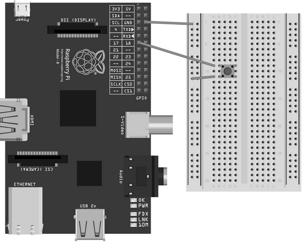

# Python Picamera Setup

A camera workshop written by [Dave Jones](https://github.com/waveform80) (author of `python-picamera`), with some example projects.

## Workshop

This workshop guides you through setting up the Raspberry Pi camera module, taking pictures and video using the Python `picamera` module, connecting a physical button with the GPIO pins and programming it to control the camera.

### Connecting the camera

1. Locate the camera port next to the ethernet port
2. Lift the tab on the top
3. Place the strip in the connector (blue side facing the ethernet port)
4. While holding the strip in place, push down the tab

### Activate the camera

1. Connect a USB cable to the power
2. Login with username `pi` and password `raspberry`
3. At the command prompt enter `sudo raspi-config`
4. At the menu, navigate to `Enable Camera`
5. Select `Enable`
6. Select `Finish`
7. Select `Yes` to reboot

### Test the camera

1. Login again with username `pi` and password `raspberry`
2. At the command prompt enter `raspistill -o image.jpg`
3. On the screen you should see a preview appear for a few seconds, and then change briefly while the image is captured

### Camera programming: capture an image

Start by installing the Python `picamera` and GPIO library packages:

```
sudo apt-get install python-picamera python3-picamera python-rpi.gpio
```

1. At the command prompt enter `startx` to start the graphical desktop environment
2. Double click on `LXTerminal` to start a command line, and enter `sudo idle &` to start the Python environment
3. Select `File > New Window` from the menu to start a text editor
4. Enter the following code (case is important!):

    ```python
    import time
    import picamera

    with picamera.PiCamera() as camera:
        camera.start_preview()
        time.sleep(5)
        camera.capture('/home/pi/Desktop/image.jpg')
        camera.stop_preview()
    ```

5. Select `File > Save` from the menu and give your script a name, e.g. `workshop.py`
6. Select `Run > Run Module` from the menu (or just press `F5`) to run the script

### Camera programming: capture when activated

1. Connect the Pi to the button as shown in the diagram below:

    

2. In the text editor, import the `RPi.GPIO` module, set up GPIO pin 17 and change the `sleep` line to use `GPIO.wait_for_edge` like so:

    ```python
    import time
    import picamera
    import RPi.GPIO as GPIO  # new

    GPIO.setmode(GPIO.BCM)  # new
    GPIO.setup(17, GPIO.IN, GPIO.PUD_UP)  # new

    with picamera.PiCamera() as camera:
        camera.start_preview()
        GPIO.wait_for_edge(17, GPIO.FALLING)  # new
        camera.capture('/home/pi/Desktop/image.jpg')
        camera.stop_preview()
    ```

3. Delete `image.jpg` from the desktop
4. Save and run your script
5. Once the preview has started, press the button connected to your Pi to capture an image

### Camera programming: countdown capture (selfies!)

1. Modify your program to include the delay after the button wait:

    ```python
    import time
    import picamera
    import RPi.GPIO as GPIO

    GPIO.setmode(GPIO.BCM)
    GPIO.setup(17, GPIO.IN, GPIO.PUD_UP)

    with picamera.PiCamera() as camera:
        camera.start_preview()
        GPIO.wait_for_edge(17, GPIO.FALLING)
        time.sleep(5)  # new
        camera.capture('/home/pi/Desktop/image.jpg')
        camera.stop_preview()
    ```

2. Delete `image.jpg` from the desktop
3. Save and run your script
4. Press the button and try to take a selfie

### Camera programming: camcorders

1. Modify your program to record video instead:

    ```python
    import time
    import picamera
    import RPi.GPIO as GPIO

    GPIO.setmode(GPIO.BCM)
    GPIO.setup(17, GPIO.IN, GPIO.PUD_UP)

    with picamera.PiCamera() as camera:
        camera.start_preview()
        GPIO.wait_for_edge(17, GPIO.FALLING)
        camera.start_recording('/home/pi/Desktop/video.h264')
        time.sleep(1)
        GPIO.wait_for_edge(17, GPIO.FALLING)
        camera.stop_recording()
        camera.stop_preview()
    ```

2. Save and run your script
3. Press the button to start recording video; press it again to stop and exit the program

### Camera programming: circular buffers

1. Modify your program to continually record to a circular buffer, and write it to disk when the button is pressed:

    ```python
    import io
    import time
    import picamera
    import RPi.GPIO as GPIO

    GPIO.setmode(GPIO.BCM)
    GPIO.setup(17, GPIO.IN, GPIO.PUD_UP)

    with picamera.PiCamera() as camera:
        stream = picamera.PiCameraCircularIO(camera, seconds=20)
        camera.start_preview()
        camera.start_recording(stream, format='h264')
        GPIO.wait_for_edge(17, GPIO.FALLING)
        camera.stop_recording()
        camera.stop_preview()
        for frame in stream.frames:
            if frame.header:
                stream.seek(frame.position)
                break
        with io.open('/home/pi/Desktop/video.h264', 'wb') as output:
            while True:
                data = stream.read1()
                if not data:
                    break
                output.write(data)
    ```

2. Delete `video.h264` from the desktop
3. Save and run your script
4. Press the button to save the last 20+ seconds of video to the drive

## Camera Project Ideas

The tasks presented in the workshop may seem basic, but with some simple alterations they can form the basis for numerous interesting projects:

### Time-lapse photography

A time-lapse sequence can be easily constructed by running the basic capture program in a loop, and adjusting the delay to the gap required. Timelapse sequences can be used to visualise many natural processes that are not easy to see otherwise such as plant growth and decay, long term construction projects and weather cycles. Here is some example code:

```python
import time
import picamera

VIDEO_DAYS = 5
FRAMES_PER_HOUR = 1
FRAMES = FRAMES_PER_HOUR * 24 * VIDEO_DAYS

def capture_frame(frame):
    with picamera.PiCamera() as cam:
        time.sleep(2)
        cam.capture('/home/pi/Desktop/frame%03d.jpg' % frame)

# Capture the images
for frame in range(FRAMES):
    # Note the time before the capture
    start = time.time()
    capture_frame(frame)
    # Wait for the next capture. Note that we take into
    # account the length of time it took to capture the
    # image when calculating the delay
    time.sleep(
        int(60 * 60 / FRAMES_PER_HOUR) - (time.time() - start)
    )
```

Once the images have been captured you can use the following FFMPEG command line to construct a video from the images, after installing `ffmpeg` with `sudo apt-get install ffmpeg`:

```
ffmpeg -y -f image2 -i /home/pi/Desktop/frame%03d.jpg -r 24 -vcodec libx264 -profile high -preset slow /home/pi/Desktop/timelapse.mp4
```

Be aware that encoding will take at least half an hour of computation on the Pi to produce the video! You may wish to perform this step on a faster machine.

### Stop-motion animation

In a similar vein, it's quite easy to construct a stop-motion animation system with the Pi's camera. The "capture when activated" program can be run in a loop (as in the timelapse program above) to continually capture images when the button is pressed. The same FFMPEG command line can then be used to construct the final video. The major challenge with stop-motion animation is keeping the camera and the target scene sufficiently static. Here is some example code:

```python
import picamera
import RPi.GPIO as GPIO

GPIO.setmode(GPIO.BCM)
GPIO.setup(17, GPIO.IN, GPIO.PUD_UP)

with picamera.PiCamera() as camera:
    camera.start_preview()
    frame = 1
    while True:
        GPIO.wait_for_edge(17, GPIO.FALLING)
        camera.capture('/home/pi/Desktop/frame%03d.jpg' % frame)
        frame += 1
    camera.stop_preview()
```

Once the frames have all been captured, a similar FFMPEG command line to the one presented above can be used to convert the frames into a video:

```
ffmpeg -y -f image2 -i /home/pi/Desktop/frame%03d.jpg -r 24 -vcodec libx264 -profile high -preset slow /home/pi/Desktop/stop_motion.mp4
```

### Security cameras

A variety of security cameras can be built using the techniques in the workshop. By replacing the button with a pressure mat or an infrared motion sensor, you can convert either the "capture when activated" or "circular buffers" programs into security cameras. The first will capture an image when activated, the second will capture the 20 seconds of activity leading up to the sensor being activated.

### Build your own camera/camcorder

By attaching a battery to the Pi, you can construct a hand-held point-and-shoot camera quite easily using the "capture when activated" program above. For basic projects, use a physical view-finder. However, advanced students may want to try their hand at constructing a full-blown digital camera. The Adafruit site has an excellent guide here:

http://learn.adafruit.com/diy-wifi-raspberry-pi-touch-cam/overview

### Colour and shape detection

Colour detection is relatively simple, provided you are happy using rudimentary statistics on an array of numbers. Capturing an image and accessing it as an array of numbers is demonstrated in the "raw image capture" guides in the documentation:

http://picamera.readthedocs.org/en/release-1.2/recipes2.html

Shape detection is harder, but certain libraries (OpenCV in particular) have built-in routines for detecting various shapes like circles. These could be used to construct a system which performs actions in response to being shown certain colours or shapes; a bit like training an animal, but with more maths involved!

### Motion detection

An idea for more talented pupils is to see if they can detect motion simply using the camera itself; in other words, without resorting to an external sensor. Several examples can be found online without too much difficulty, but the code is definitely not aimed at beginners. Once implemented, this project can be extended into a security camera with no external components other than the camera module itself.

## Licence

Unless otherwise specified, everything in this repository is covered by the following licence:


***Python Picamera Setup*** by [Dave Jones](https://github.com/waveform80) and the [Raspberry Pi Foundation](http://raspberrypi.org) is licenced under a [Creative Commons Attribution 4.0 International License](http://creativecommons.org/licenses/by-sa/4.0/).

Based on a work at https://github.com/raspberrypilearning/python-picamera-setup
